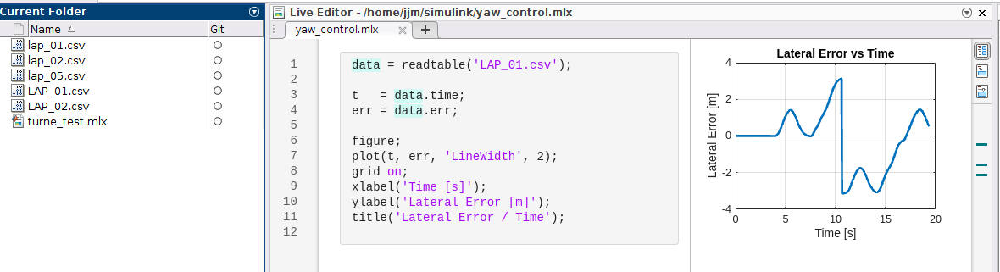
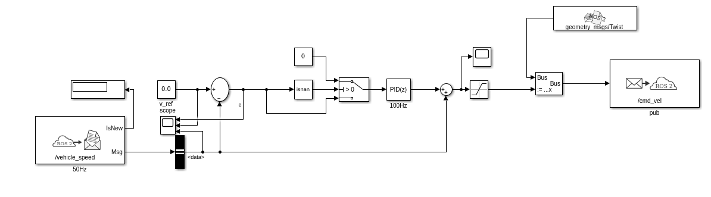
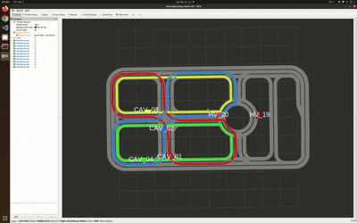
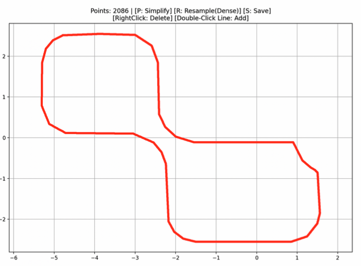
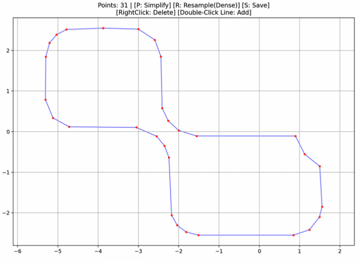
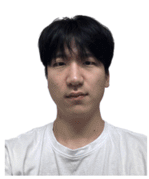

# 2025 KAIST Mobility Challenge 경진대회 대상

## 요약

ROS 2 기반으로 동작하며, Pure pursuit + PID 제어를 통해 차선이탈 92%(15회 -> 1회), 충돌 80%(5회 -> 1회) 감소

- **대회명**: 2025 KAIST Mobility Challenge 경진대회
- **주제**: V2V·V2I 기반 협력 자율주행
- **구현 기술**
  - Pure pursuit + PID 제어
  - ros2 RVIZ 시각화
  - 경로 최적화 python tool
  - ros2 v2x 통신 구현
  - 사지교차로/원형교차로 판단 알고리즘 설계/개발
  - JSON을 활용한 ros2 단일 노도 구현
- **성과**: 차선이탈 92%(15회 -> 1회), 충돌 80%(5회 -> 1회) 감소
- **성과의미**: 대상

## 개요

2025 카이스트 모빌리티 챌린지 경진대회는 다수의 **CAV(Connected and Autonomous Vehicle)** 및 **HV(Human-driven Vehicle)** 가 공존하는 상황에서 CAV 주행 알고리즘을 개발하여 겨루는 대회이다.


## 구현 기술

### 1. Pure pursuit + PID 제어

Matlab Simulink를 활용하여 횡방향 및 종방향 제어에 Pure pursuit +  Pid 제어를 구현




```c++
    double compute_path_yaw(const Path& path, int idx) {
        int path_size = static_cast<int>(path.X.size());
        if (idx >= path_size - 1) return 0.0;

        // 현재부터 3칸 앞까지의 방향 (노이즈 감소)
        double dx = path.X[idx + 3] - path.X[idx];
        double dy = path.Y[idx + 3] - path.Y[idx];
        return std::atan2(dy, dx);
    }

    // === P 제어 ===
    const double Kp = 1.1;

    // 속도 제어 - vehicle_speed 직접 사용
    double current_v = encoder_received_ ? encoder_v_ : 0.0;
    double v_error = current_v - target_v;
```

---

### 2. ros2 RVIZ 시각화

본대회 환경에서는 시뮬레이터 사용이 불가능해 ros2 RVIZ 시각화 및 로깅 구현.

```bash
ros2 launch map_visualizer visualize.launch.py
```



---

### 3. 경로 최적화 python tool

> 시뮬레이터와 다른 주행 특성으로 CAV의 PATH를 관리할 tool이 필요하다고 판단해 개발.

경로 최적화 python tool은 `tool/path_viz.py` 파일에서 관리된다.

```bash
python3 path_viz.py ../src/pure_pursuit_controller/config/CAV_01_3.json
```




### 4. ros2 v2x 통신 구현

CAV 4대와 HV 2대, 총 6대의 차량의 POSE, VELOCITY를 서로 공유하기 위해 ROS_DOMAIN_BRIDGE를 이용.

`src/pure_pursuit_controller/config/cav*_bridge.yaml` 파일에서 각 CAV의 domain_bridge가 관리된다.

```json
name: cav1_bridge
from_domain: 1
to_domain: 2
topics:
  Ego_pose:
    type: geometry_msgs/msg/PoseStamped
    reliability: best_effort
    remap: /CAV1_pose
    to_domain: 2

  Ego_pose:
    type: geometry_msgs/msg/PoseStamped
    reliability: best_effort
    remap: /CAV1_pose
    to_domain: 3

  Ego_pose:
    type: geometry_msgs/msg/PoseStamped
    reliability: best_effort
    remap: /CAV1_pose
    to_domain: 4

```

---

### 5. 사지교차로/원형교차로 판단 알고리즘 설계/개발

`src/pure_pursuit_controller/include/pure_pursuit_controller/collision_checker.hpp` 파일의 `CollisionChecker에서` 관리된다.

```C++

  bool check_hardcoded(const Path &my_path, int my_idx, int other_id,
                       const Path &other_path,
                       const std::map<int, Point> &others_pos,
                       const std::map<int, bool> &others_received,
                       int my_logical_id) {
    if (others_received.find(other_id) == others_received.end() ||
        !others_received.at(other_id))
      return false;

    if (!is_on_path(other_path, others_pos.at(other_id).x,
                    others_pos.at(other_id).y, 0.2)) {
      return false;
    }

    int other_idx = find_closest_index_internal(
        other_path, others_pos.at(other_id).x, others_pos.at(other_id).y);
    int my_path_size = static_cast<int>(my_path.X.size());
    int other_path_size = static_cast<int>(other_path.X.size());

    double my_accum = 0.0;
    double dist_th = 0.25;
    double dist_sq_threshold = dist_th * dist_th; // 의미:

    for (int i = my_idx; i < my_path_size - 1 && my_accum < 1.5; ++i) {
      double dx_my = my_path.X[i + 1] - my_path.X[i];
      double dy_my = my_path.Y[i + 1] - my_path.Y[i];
      my_accum += std::sqrt(dx_my * dx_my + dy_my * dy_my);

      double other_accum = 0.0;
      for (int j = other_idx; j < other_path_size - 1 && other_accum < 1.5;
           ++j) {
        double dx_other = other_path.X[j + 1] - other_path.X[j];
        double dy_other = other_path.Y[j + 1] - other_path.Y[j];
        other_accum += std::sqrt(dx_other * dx_other + dy_other * dy_other);

        double dx_cross = my_path.X[i] - other_path.X[j];
        double dy_cross = my_path.Y[i] - other_path.Y[j];

        if (dx_cross * dx_cross + dy_cross * dy_cross < dist_sq_threshold) {
          if (my_accum > other_accum + 0.15)
            return true;
          if (std::abs(my_accum - other_accum) <= 0.15 &&
              my_logical_id > other_id)
            return true;
        }
      }
    }
    return false;
  }

  int find_closest_index_internal(const Path &path, double x, double y) {
    int idx = 0;
    double min_sq_d = 1.0e18; // Use a larg dxe number, (1e9)^2

    int path_size = static_cast<int>(path.X.size());
    for (int i = 0; i < path_size; ++i) {
      double dx = path.X[i] - x;
      double dy = path.Y[i] - y;
      double sq_d = dx * dx + dy * dy;
      if (sq_d < min_sq_d) {
        min_sq_d = sq_d;
        idx = i;
      }
    }
    return idx;
  }

```

## 추가 자료 (참고논문)

- H. Bae, E. Lee, J. Han, M. Kang, J. Kim, J. Seo, M. Noh, and H. Ahn,
  **"Miniature Testbed for Validating Multi-Agent Cooperative Autonomous Driving"**
  *arXiv:2511.11022v1 [cs.RO]*, Nov. 2025.
  [[Paper]](https://arxiv.org/abs/2511.11022)

## 팀원

|||||||
|:-:|:-:|:-:|:-:|:-:|:-:|
|[송준상](https://github.com/perman0519)|[정우진](https://github.com/woojinJeong52)|[이기현](https://github.com/leegyun02)|[한다인](https://github.com/gksekdls032)|[이다빈](https://github.com/Devin727)|[조재민](https://github.com/jjm159874)|
